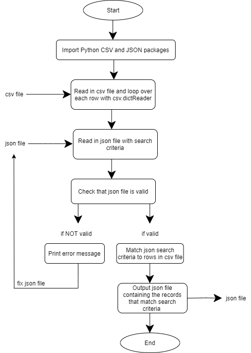

# JSON Search Criteria Project

## Python program that takes in a csv file and a json search criteria file and outputs a json file containing the records that match the search criteria.

### Files in folder:

- **capital_projects.csv** is the csv data set
- **json_search_criteria.json** is the json search criteria file
- **Maya_JSON_search_criteria_project.ipynb** is the Python code in jupiter notebook
- **json_diagram.png** is diagram of program (see below)

